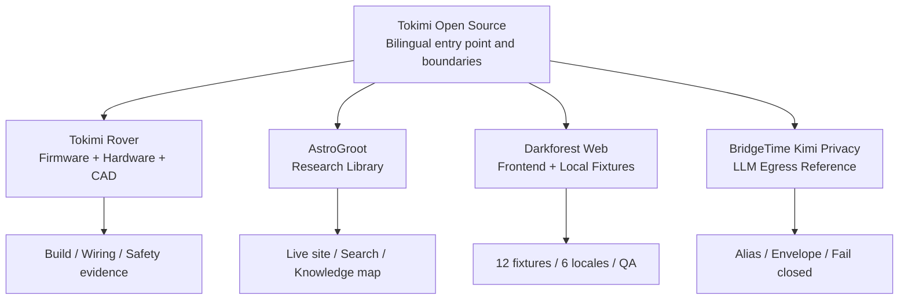

<div align="center">

# Tokimi Open Source

**Keep source, design decisions, verification evidence, and known limitations on the same workbench.**

[繁體中文](README.md) · [English](README.en.md)

[](https://github.com/TokimiSpace/TokimiSpace.github.io/actions/workflows/pages.yml)
[](#language-switching)
[](#privacy-and-link-previews)
[](LICENSES.md)

[Chinese open-source hub](https://tokimispace.github.io/?lang=zh-TW) ·
[English hub](https://tokimispace.github.io/?lang=en) ·
[Official Tokimi website](https://tokimi.space/en/open-source/) ·
[GitHub organization](https://github.com/TokimiSpace)

</div>


This repository contains [TokimiSpace's GitHub Pages site](https://tokimispace.github.io/?lang=en)
and acts as the common entry point to four open-source directions. It explains not only **what is
open**, but also what remains private, what has actually been verified, and which names and assets
have separate rights boundaries.

## Four projects at a glance

| Project | Best for | What is open | Boundary to understand first |
| --- | --- | --- | --- |
| 🚗 [Tokimi Rover](https://github.com/TokimiSpace/tokimi-rover) | ESP32, robotics, and physical makers | Two-controller firmware, wiring docs, audit evidence, and the Supercar V3 Blender top-cover CAD | Source and firmware builds were audited; this audit did not physically safety-test the car, and the CAD size discrepancy still needs an A4 physical fit-check |
| 🔭 [AstroGroot](https://github.com/topben/astrogroot) | Astronomy, aerospace, robotics research, and search tooling | Deno/Hono site, collectors, trilingual search, knowledge map, APIs, and MCP | Application code is MIT; indexed third-party material keeps its terms, and AI summaries must be checked against original sources |
| 🌲 [Darkforest Web](https://github.com/TokimiSpace/darkforest-web) | Web-game UI, Deno, Preact, and accessibility contributors | Browser frontend, 12 local fixtures, 6 interface locales, and the QA toolchain | Pre-alpha, loopback-only demo; no production matchmaking, private game core, official service contract, or LiveOps |
| 🛡️ [BridgeTime Kimi Privacy](https://github.com/TokimiSpace/bridgetime-kimi-privacy) | LLM privacy, data minimization, and TypeScript boundary research | Aliasing, a minimal envelope, fail-closed egress, read-only tools, and offline capture tests | Pseudonymization, not anonymization; the production assistant was disabled as of 2026-08-25, and rules cannot prove detection of all personal data |

### Try the live services

- [AstroGroot live research library](https://astrogroot.org/?lang=en)
- [Official Darkforest version](https://darkforest.tw/) (a different scope from the open local demo)
- [BridgeTime scheduling service](https://bridgetime.org/) (the full service is not open in the privacy reference repo)
- [Official Tokimi open-source guide](https://tokimi.space/en/open-source/)

## How the hub relates to each project



The portal does not duplicate each project's full documentation. Every card sends readers to that
repository's bilingual README, licence, and reproducible verification instructions.

## Local preview in 60 seconds

The site is dependency-free HTML, CSS, and JavaScript; there is no build step:

```bash
git clone https://github.com/TokimiSpace/TokimiSpace.github.io.git
cd TokimiSpace.github.io
python3 -m http.server 8000
```

Open:

- Chinese: <http://localhost:8000/?lang=zh-TW>
- English: <http://localhost:8000/?lang=en>

Run the publication checks:

```bash
python3 scripts/check_site.py
node --check main.js
```

The checks cover local links, required scope language for all four projects, URL language parameters,
JSON-LD, social metadata, the 1200 × 630 preview, licence markers, and forbidden overclaims.

## Language switching

Traditional Chinese is the site's default. The header switches between Chinese and English:

- `?lang=zh-TW` and `?lang=en` are directly shareable and bookmarkable;
- a valid URL parameter takes precedence over the remembered browser choice;
- other query parameters and the section anchor survive a language change;
- browser back/forward restores the corresponding language;
- the preference is stored only in local `localStorage` and is not sent to analytics.

Both languages are authored into one static page. The site uses no automatic translation or remote
language API.

## Privacy and link previews

The production page loads no analytics, trackers, third-party fonts, remote images, or package
dependencies. It leaves the site only after a visitor follows a project or official-site link.

LINE, Facebook, and Twitter/X previews use the committed
[1200 × 630 PNG](social-card-open-source-v3.png). The [home page](index.html) explicitly defines
Open Graph, Twitter Card, alt text, canonical, robots, and four-project JSON-LD metadata. When the
preview changes, use a new versioned filename and update both metadata and
[site checks](scripts/check_site.py), so social crawlers do not keep a stale image URL.

## Repository map

```text
TokimiSpace.github.io/
├── index.html                    # Bilingual content, SEO, and JSON-LD
├── styles.css                    # Responsive layout and project visuals
├── main.js                       # Language URLs, history, progressive enhancement
├── social-card-open-source-v3.* # Traceable SVG source, PNG, and licence sidecar
├── scripts/check_site.py         # Publication-boundary and static-site checks
├── robots.txt
├── sitemap.xml
├── LICENSES.md
└── TRADEMARKS.md
```

The AstroGroot knowledge map, abstract Darkforest visual, and BridgeTime envelope diagram on the site
are original CSS/SVG explanations for this portal. They are not production game art, third-party
research images, or evidence of a live deployment.

## Publishing

After a push to `main`, [GitHub Actions](.github/workflows/pages.yml):

1. validates the static site and JavaScript;
2. uploads the repository root as a GitHub Pages artifact;
3. deploys [tokimispace.github.io](https://tokimispace.github.io/?lang=en).

Pull requests run the same site checks without deployment. Never add API keys, customer data,
internal documents, or assets with unclear rights to this static site.

## Contributing, licences, and marks

Small copy, accessibility, and link fixes are welcome as pull requests. Open an issue with verifiable
sources before changing project scope, licensing, official identity, privacy claims, or the set of
featured projects.

This repository uses path-specific **Apache-2.0** and **CC BY 4.0** terms; see
[LICENSES.md](LICENSES.md). This portal does not change the licence map of any linked project and
does not relicense AstroGroot's indexed third-party material.

Tokimi, 時見數位科技, and official project identities are not licensed with the source; see
[TRADEMARKS.md](TRADEMARKS.md). A fork may describe its origin truthfully, but must not imply
official certification, sponsorship, or affiliation.
