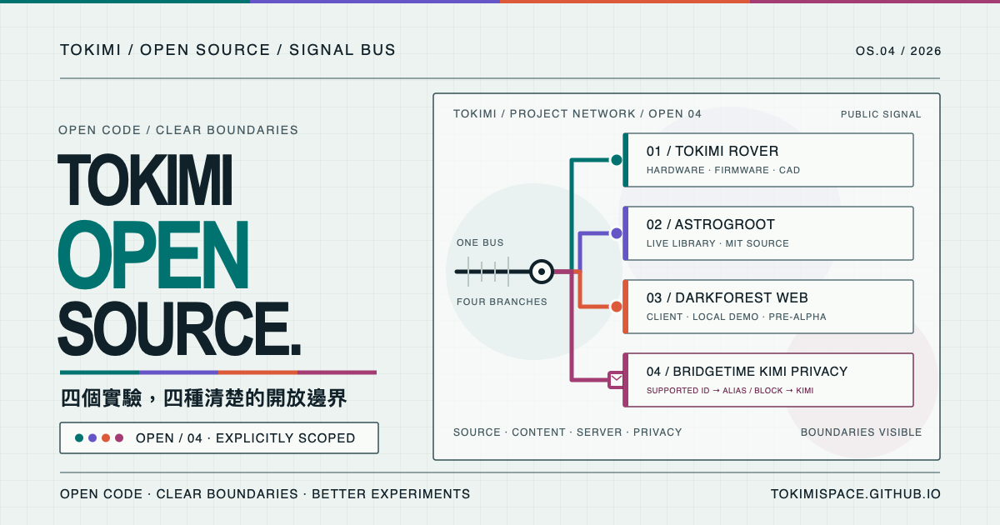

# Tokimi Open Source

Source for the bilingual organization page at
[tokimispace.github.io](https://tokimispace.github.io/?lang=en).
Tokimi's official website is [tokimi.space](https://tokimi.space/).
The official bilingual gateway is available in
[Traditional Chinese](https://tokimi.space/open-source/) and
[English](https://tokimi.space/en/open-source/).

[Traditional Chinese](https://tokimispace.github.io/?lang=zh-TW) ·
[English](https://tokimispace.github.io/?lang=en)



The page introduces Tokimi projects without hiding their current boundaries:

- [Tokimi Rover](https://github.com/TokimiSpace/tokimi-rover) is a supervised,
  open-source hardware prototype whose source and firmware builds have been
  audited. Its owner-selected
  [Supercar V3 top-cover CAD](https://github.com/TokimiSpace/tokimi-rover/tree/main/hardware/cad/top-cover-v3)
  is also published, but the current audit did not physically retest the
  assembled rover or reconcile the V3 195 × 100 mm pattern with the historical
  203 × 105 mm rover record.
- [AstroGroot](https://astrogroot.org/) is a live automated research library
  for astronomy, space science, and robotics. Its application source is public
  at [topben/astrogroot](https://github.com/topben/astrogroot) under the MIT
  License. Indexed third-party material keeps its original terms, and AI
  summaries are discovery aids rather than substitutes for original sources.
- [Darkforest Web](https://github.com/TokimiSpace/darkforest-web) is the
  Apache-2.0 browser client and local demo for Darkforest: Reset Protocol. The
  standalone public-demo schema v1 is intentionally incompatible with and does
  not connect to the official service. The private match server, game core,
  live operations, and unreleased content pipeline are deliberately not
  included.
- [BridgeTime Kimi Privacy](https://github.com/TokimiSpace/bridgetime-kimi-privacy)
  is a hardened reference extraction of BridgeTime's pre-provider aliasing,
  data-minimization, and outbound-envelope checks. The production assistant was
  disabled as of 2026-08-25, and the extraction is not the complete BridgeTime
  service. It implements pseudonymization, not anonymization: it cannot detect
  every form of sensitive data; dates, counts, status codes, time ranges,
  business context, and opaque tokens may still reach the model provider. The live scheduling service
  remains at [bridgetime.org](https://bridgetime.org/).

Visitors can switch directly between 中文 and English from the page header.
The selected language is reflected in the shareable URL and remembered locally
in the browser. A valid `?lang=en` or `?lang=zh-TW` parameter takes precedence
over the stored preference; other query parameters and section anchors are
preserved when switching.

## Local preview

The site is dependency-free HTML, CSS, and JavaScript. From this repository's
root, start any static HTTP server—for example:

```sh
python3 -m http.server 8000
```

Then open `http://localhost:8000/`. Run the publication checks with:

```sh
python3 scripts/check_site.py
node --check main.js
```

## Publishing

Every push to `main` validates the page, uploads the repository root as a
GitHub Pages artifact, and deploys it through GitHub Actions. Pull requests run
the same local validation without deploying.

The page loads no analytics, trackers, third-party fonts, remote images, or
package dependencies. Project links deliberately point to their separate
repositories—`TokimiSpace/tokimi-rover`, `topben/astrogroot`,
`TokimiSpace/darkforest-web`, and
`TokimiSpace/bridgetime-kimi-privacy`—rather than being inferred from this
organization-site repository. The official-site link
deliberately points to `tokimi.space`; this GitHub Pages site remains the
open-source project portal.

Link previews for LINE and Twitter/X use a committed 1200 × 630 PNG generated
from `social-card-open-source-v3.svg`. Its signal bus branches to Tokimi Rover,
AstroGroot, Darkforest Web, and the BridgeTime Kimi privacy envelope without
relying on project screenshots or remote assets. The versioned filename
intentionally gives social crawlers a new URL when the artwork changes; update
both Open Graph and Twitter Card tags when publishing a later version.

## Content boundaries

The AstroGroot knowledge-map visual and the abstract Darkforest visual are
original inline CSS/SVG artwork for this page, not copied logos, screenshots,
game footage, or production game art. The Darkforest entry describes only the
separately licensed public web client and local demo; it makes no claim that the
private game core, official contract, match server, live service, or unreleased
content pipeline is open source or compatible with the public demo. The
BridgeTime envelope diagram is an explanatory original illustration. It shows
the intended pseudonymization boundary, not proof that every identifier can be
detected or that no aliased business data reaches a provider.

See [LICENSES.md](LICENSES.md) for path-specific licensing and
[TRADEMARKS.md](TRADEMARKS.md) for brand boundaries.
