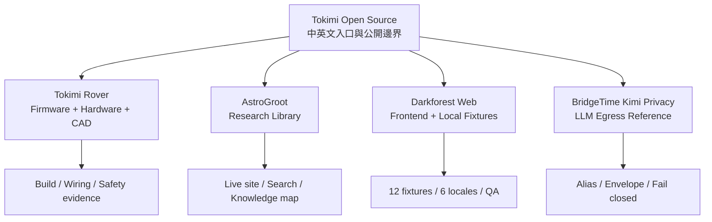

<div align="center">

# Tokimi Open Source

**把原始碼、設計決策、驗證證據與已知限制放在同一張工作台上。**

[繁體中文](README.md) · [English](README.en.md)

[](https://github.com/TokimiSpace/TokimiSpace.github.io/actions/workflows/pages.yml)
[](#語言切換)
[](#隱私與分享預覽)
[](LICENSES.md)

[中文開源首頁](https://tokimispace.github.io/?lang=zh-TW) ·
[English hub](https://tokimispace.github.io/?lang=en) ·
[Tokimi 官方網站](https://tokimi.space/open-source/) ·
[GitHub Organization](https://github.com/TokimiSpace)

</div>


這個 repository 是 [TokimiSpace GitHub Pages](https://tokimispace.github.io/?lang=zh-TW)
的原始碼，也是 Tokimi 四個開源方向的統一入口。網站不只列出「已公開什麼」，也把**沒有公開什麼、
實際驗證到哪裡、哪些名稱與素材另有權利邊界**一起說清楚。

## 四個專案，一眼看懂

| 專案 | 適合誰 | 公開內容 | 先知道的邊界 |
| --- | --- | --- | --- |
| 🚗 [Tokimi Rover](https://github.com/TokimiSpace/tokimi-rover) | ESP32、機器人與實體製作者 | 雙控制器韌體、接線文件、稽核紀錄、Supercar V3 Blender 車殼 CAD | source 與 firmware build 已稽核；本次沒有重新做實車安全測試，CAD 尺寸衝突仍待 A4 實體 fit-check |
| 🔭 [AstroGroot](https://github.com/topben/astrogroot) | 天文、航太、機器人研究與搜尋工具開發者 | Deno/Hono 網站、收集器、三語搜尋、知識圖、API 與 MCP | application code 採 MIT；被索引的第三方內容保留原條款，AI 摘要需回原始來源核對 |
| 🌲 [Darkforest Web](https://github.com/TokimiSpace/darkforest-web) | Web Game UI、Deno、Preact 與無障礙貢獻者 | 瀏覽器前端、12 組本機 fixtures、6 語介面與完整 QA 工具 | pre-alpha、loopback-only demo；不含正式配對、私人 game core、官方 service contract 或 LiveOps |
| 🛡️ [BridgeTime Kimi Privacy](https://github.com/TokimiSpace/bridgetime-kimi-privacy) | LLM 隱私、資料最小化與 TypeScript 安全邊界研究者 | 別名化、最小 envelope、fail-closed egress、唯讀 tools、離線 capture tests | 是 pseudonymization，不是匿名化；production assistant 截至 2026-08-25 為 disabled，不能證明所有個資都會被辨識 |

### 直接體驗

- [AstroGroot 線上研究圖書館](https://astrogroot.org/?lang=zh-TW)
- [Darkforest 官方版本](https://darkforest.tw/)（與開源本機 demo 的範圍不同）
- [BridgeTime 預約管理服務](https://bridgetime.org/)（完整服務並未在隱私 reference repo 中開源）
- [Tokimi 官方開源導覽](https://tokimi.space/open-source/)

## 入口與專案的關係



這個 portal 不會複製各專案的完整文件；每張專案卡會帶你到該 repo 的中英文 README、授權與
可重現驗證方式。

## 60 秒本機預覽

網站是 dependency-free 的 HTML、CSS 與 JavaScript，不需建置：

```bash
git clone https://github.com/TokimiSpace/TokimiSpace.github.io.git
cd TokimiSpace.github.io
python3 -m http.server 8000
```

打開：

- 中文：<http://localhost:8000/?lang=zh-TW>
- English：<http://localhost:8000/?lang=en>

發布前檢查：

```bash
python3 scripts/check_site.py
node --check main.js
```

檢查會驗證本機連結、四個專案的必要範圍文字、語言參數、JSON-LD、社群 metadata、
1200 × 630 預覽圖、授權標記及禁止的過度宣稱。

## 語言切換

首頁以繁體中文為預設，頁首可切換中文／英文：

- `?lang=zh-TW` 與 `?lang=en` 可直接分享、加入書籤；
- 有效 URL 參數優先於瀏覽器已記住的選擇；
- 切換語言時會保留其他 query parameters 與 section anchor；
- browser back／forward 會恢復對應語言；
- 偏好只存於本機 `localStorage`，不會送到分析服務。

這是單一靜態頁面中的雙語內容，不依賴自動翻譯或外部語言 API。

## 隱私與分享預覽

正式頁面不載入 analytics、tracker、第三方字型、remote image 或 package dependency。它只會在你
點擊專案連結時前往 GitHub 或各官方網站。

LINE、Facebook 與 Twitter/X 分享使用 repository 內的
[1200 × 630 PNG](social-card-open-source-v3.png)。Open Graph、Twitter Card、alt text、
canonical、robots 與四專案 JSON-LD 都由 [首頁](index.html) 明確設定。更新分享圖時請使用新的
versioned filename，並同步修改 metadata 與 [網站檢查](scripts/check_site.py)，避免社群 crawler
沿用舊快取。

## Repository 地圖

```text
TokimiSpace.github.io/
├── index.html                    # 雙語內容、SEO、JSON-LD
├── styles.css                    # 響應式版面與專案視覺
├── main.js                       # 語言 URL、歷史紀錄與漸進增強
├── social-card-open-source-v3.* # 可追溯的 SVG 原稿、PNG 與 license sidecar
├── scripts/check_site.py         # 發布邊界與靜態網站檢查
├── robots.txt
├── sitemap.xml
├── LICENSES.md
└── TRADEMARKS.md
```

網站中的 AstroGroot 知識圖、Darkforest 抽象視覺與 BridgeTime envelope 圖均為此頁的原創
CSS／SVG 說明圖，不是 production game art、第三方研究圖片或線上部署證據。

## 發布

推送到 `main` 後，[GitHub Actions](.github/workflows/pages.yml) 會：

1. 執行靜態網站與 JavaScript 檢查；
2. 上傳 repository root 作為 GitHub Pages artifact；
3. 部署到 [tokimispace.github.io](https://tokimispace.github.io/?lang=zh-TW)。

Pull request 會執行相同的網站驗證，但不部署。請勿把 API key、客戶資料、內部文件或權利未確認的素材
加入此靜態網站。

## 貢獻、授權與品牌

小型文字、可及性與連結修正可直接提出 pull request；涉及專案範圍、授權、官方身份、
隱私承諾或新增公開專案時，請先開 issue 討論並附上可驗證來源。

本 repository 依路徑採 **Apache-2.0** 與 **CC BY 4.0**，詳見
[LICENSES.md](LICENSES.md)。這個入口的授權不會改變四個專案各自的 license map，也不會重新授權
AstroGroot 索引的第三方內容。

Tokimi、時見數位科技與官方專案識別不隨原始碼授權，詳見
[TRADEMARKS.md](TRADEMARKS.md)。可以忠實描述 fork 的來源，但不得暗示官方認證、贊助或合作關係。
